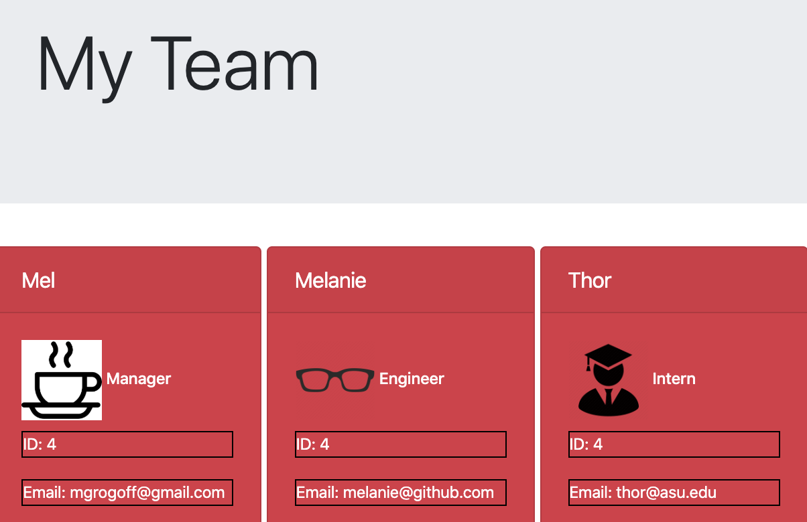

# teamgenerator

This app is coded via JavaScript, Node, HTML5, and is a CLI application that allows users to create dynamically-generated engineering teams based on their inputs. 

Users may open this application by cloning the repo to their local computer, opening Terminal/Bash, going to the folder, and typing: ```node app.js```. 

Screenshot Preview:


